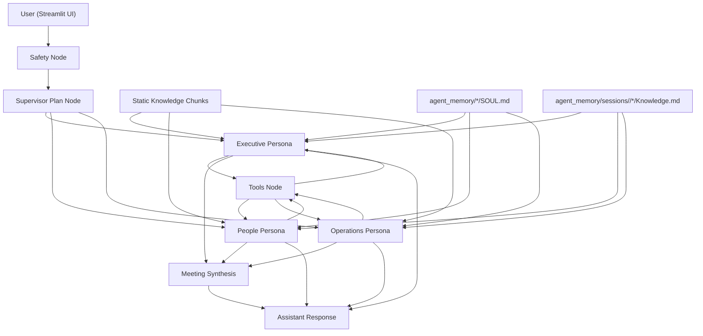

# Edtronaut AI Co-worker Engine

An AI workplace-simulation prototype built with Streamlit, LangGraph, and Ollama. The system simulates a small group of AI co-workers that respond as role-based stakeholders, route requests through a hidden supervisor, retrieve scenario knowledge, call business-style tools, and export polished portfolio artifacts.

This repository currently ships one scenario: a cross-functional change rollout simulation with three personas:

- Executive Sponsor
- People Lead
- Regional Operations Lead

## What This Project Does

The application presents the user with a workplace simulation rather than a generic chatbot. The user can ask broad rollout questions, direct a question to a specific persona by tagging them, or request outputs that can be saved into a portfolio pack.

Core behaviors implemented in the codebase:

- A hidden Supervisor chooses between direct persona routing and a cross-functional meeting.
- Personas maintain tone, role constraints, and lightweight reputation state.
- Scenario knowledge is retrieved from a local knowledge base using simple vector-style similarity.
- Agent identity is stored in shared markdown files, while evolving agent knowledge is session-scoped under `agent_memory/`.
- Jira-style tool hooks are available for list/search/create/comment/status actions against a fake Jira backend.
- Assistant responses can be saved as portfolio artifacts and exported as a PDF.
- Safety checks block forbidden language such as wagering terms.

## Demo Flow

Typical end-to-end flow:

1. The user asks a question in the Streamlit chat UI.
2. A safety node checks for forbidden language.
3. The Supervisor routes the request to one persona or to a meeting flow.
4. The selected persona reads:
   - its shared `SOUL.md`
   - its session `Knowledge.md`
   - recent conversation history
   - retrieved scenario knowledge
5. The persona may call tools if the model supports tool calling.
6. The final response is shown in chat.
7. The response can be saved as:
   - Final plan
   - Internal communication
   - Executive update
8. Once all required artifacts exist, the portfolio pack can be exported as a PDF.

## Architecture



### Main Runtime Pieces

- [app.py](/Users/dinhtran/Projects/Qidyyy/edtronaunt-ai-co-worker/app.py): Streamlit UI, chat loop, sidebar, portfolio actions.
- [engine.py](/Users/dinhtran/Projects/Qidyyy/edtronaunt-ai-co-worker/my-app/coworker_engine/engine.py): LangGraph graph definition and routing edges.
- [agent.py](/Users/dinhtran/Projects/Qidyyy/edtronaunt-ai-co-worker/my-app/coworker_engine/agent.py): hidden Supervisor planning node.
- [nodes.py](/Users/dinhtran/Projects/Qidyyy/edtronaunt-ai-co-worker/my-app/coworker_engine/utils/nodes.py): persona nodes, safety handling, meeting synthesis.
- [simulation.py](/Users/dinhtran/Projects/Qidyyy/edtronaunt-ai-co-worker/my-app/coworker_engine/simulation.py): scenario and persona definitions.
- [knowledge.py](/Users/dinhtran/Projects/Qidyyy/edtronaunt-ai-co-worker/my-app/coworker_engine/utils/knowledge.py): retrieval corpus and similarity search.
- [agent_memory.py](/Users/dinhtran/Projects/Qidyyy/edtronaunt-ai-co-worker/my-app/coworker_engine/utils/agent_memory.py): file-backed `SOUL.md` and `Knowledge.md` management.
- [tools.py](/Users/dinhtran/Projects/Qidyyy/edtronaunt-ai-co-worker/my-app/coworker_engine/utils/tools.py): fake Jira and utility tool surface.
- [portfolio.py](/Users/dinhtran/Projects/Qidyyy/edtronaunt-ai-co-worker/my-app/coworker_engine/utils/portfolio.py): artifact registry and PDF export.
- [safety.py](/Users/dinhtran/Projects/Qidyyy/edtronaunt-ai-co-worker/my-app/coworker_engine/utils/safety.py): forbidden language guardrails.

## Agent Design

### Personas

The active simulation defines three personas with:

- route name
- display name
- agent ID
- aliases for direct tagging
- system prompt
- reputation triggers

Examples:

- `@executive`, `@sponsor`, `@leadership`
- `@people`, `@talent`, `@hr`
- `@operations`, `@ops`, `@regional`

### Supervisor

The Supervisor is invisible to the user. It decides whether the request should:

- go to one coworker directly
- become a meeting across all coworkers

It also injects a hint after repeated turns if the user appears stuck.

### Reputation and Alignment

Each persona tracks lightweight state in the graph:

- `reputation`
- `alignment_score`
- per-persona reputation maps
- per-turn update flags

Reputation increases when the user uses language aligned with that persona’s trigger phrases.

## Markdown-Based Agent Memory

One of the project’s newer additions is file-backed agent memory.

Each agent now has two markdown files:

- `SOUL.md`: stable identity, role, tone, and core instructions
- `Knowledge.md`: evolving working memory and task journal

Shared baseline files live under:

- [agent_memory/supervisor/SOUL.md](/Users/dinhtran/Projects/Qidyyy/edtronaunt-ai-co-worker/agent_memory/supervisor/SOUL.md)
- [agent_memory/executive/SOUL.md](/Users/dinhtran/Projects/Qidyyy/edtronaunt-ai-co-worker/agent_memory/executive/SOUL.md)
- [agent_memory/people/SOUL.md](/Users/dinhtran/Projects/Qidyyy/edtronaunt-ai-co-worker/agent_memory/people/SOUL.md)
- [agent_memory/operations/SOUL.md](/Users/dinhtran/Projects/Qidyyy/edtronaunt-ai-co-worker/agent_memory/operations/SOUL.md)
- [agent_memory/supervisor/Knowledge.md](/Users/dinhtran/Projects/Qidyyy/edtronaunt-ai-co-worker/agent_memory/supervisor/Knowledge.md)
- [agent_memory/executive/Knowledge.md](/Users/dinhtran/Projects/Qidyyy/edtronaunt-ai-co-worker/agent_memory/executive/Knowledge.md)
- [agent_memory/people/Knowledge.md](/Users/dinhtran/Projects/Qidyyy/edtronaunt-ai-co-worker/agent_memory/people/Knowledge.md)
- [agent_memory/operations/Knowledge.md](/Users/dinhtran/Projects/Qidyyy/edtronaunt-ai-co-worker/agent_memory/operations/Knowledge.md)

Current runtime behavior:

- `SOUL.md` stays shared per persona and is reused across all sessions.
- `Knowledge.md` is session-scoped for Streamlit conversations and is written under `agent_memory/sessions/<session_id>/<route>/Knowledge.md`.
- The legacy shared `agent_memory/<route>/Knowledge.md` path still works as a fallback when no `session_id` is provided.

How memory is used:

- persona prompts load both `SOUL.md` and `Knowledge.md`
- Supervisor prompts load its own `SOUL.md` and `Knowledge.md`
- task updates append to `Knowledge.md`
- tool handoffs append to `Knowledge.md`
- meeting synthesis appends to Supervisor `Knowledge.md`
- retrieval reads the active session’s persona `Knowledge.md`, not just static Python chunks

In the Streamlit app, `session_id` is derived from the per-session `thread_id`, so one browser session does not retrieve another session’s durable notes.

You can relocate the memory directory with:

```bash
AGENT_MEMORY_ROOT=/absolute/path/to/agent_memory
```

## Knowledge Retrieval

The project uses a local retrieval layer implemented in [knowledge.py](/Users/dinhtran/Projects/Qidyyy/edtronaunt-ai-co-worker/my-app/coworker_engine/utils/knowledge.py).

Important implementation details:

- The base corpus is defined in Python as `KnowledgeChunk` records.
- The system augments that corpus with each persona’s `Knowledge.md`.
- When a `session_id` is provided, retrieval reads only that session’s dynamic `Knowledge.md` files.
- Tokenization is a regex-based lowercase word split.
- Embeddings are a hashed bag-of-words vector of size `512`.
- If `faiss` is available, FAISS inner-product search is used.
- If `faiss` is unavailable, a NumPy fallback ranks chunks by cosine-like dot product.

This is lightweight and practical for a prototype, but it is not using a production semantic embedding model yet.

## Tooling and Fake Jira Integration

The personas can call tools for live operational context. The current tool set includes:

- KPI lookup
- simulation context retrieval
- Jira task listing
- Jira task search
- Jira task creation
- Jira comment creation
- Jira status updates

The Jira integration now ships with a bundled Flask + SQLite fake Jira service under [my-app/fake_jira](/Users/dinhtran/Projects/Qidyyy/edtronaunt-ai-co-worker/my-app/fake_jira). By default the chat tools point to:

```text
http://127.0.0.1:5000
```

Override it with:

```bash
FAKE_JIRA_BASE_URL=http://your-host:5000
```

For the local demo path, use [scripts/run_demo.py](/Users/dinhtran/Projects/Qidyyy/edtronaunt-ai-co-worker/scripts/run_demo.py), which starts the bundled fake Jira service and the Streamlit app together. If the service is unavailable, the tool layer returns a graceful fallback string instead of crashing the chat flow.

## Portfolio Pack Export

The Streamlit app lets the user save assistant outputs as structured artifacts.

Artifact types:

- `final_plan`
- `internal_comm`
- `executive_update`

Readiness rules:

- exactly one final plan must exist
- at least one internal communication must exist
- exactly one executive update must exist

Export behavior:

- source notes are auto-enriched from retrieved knowledge sources
- forbidden language blocks export
- PDF output is generated with ReportLab
- exports are written under `exports/portfolio-packs/<thread_id>/`

The generated pack includes:

- cover page
- final plan section
- internal communications section
- executive update section
- sources and notes section

## Safety Guardrails

The current safety layer is intentionally small but explicit.

Forbidden terms currently checked:

- `bet`
- `gamble`
- `emoji`
- `wager`
- `stake`

These checks are applied:

- before persona routing in chat
- during portfolio export validation

## Project Structure

```text
.
├── agent_memory/
│   ├── executive/
│   ├── operations/
│   ├── people/
│   ├── sessions/
│   └── supervisor/
├── app.py
├── doc/
│   ├── 01. AI Engineer Intern Take-home Assignment 2.0.pdf
│   ├── 08. HRM Talent & Leadership Development - Gucci 2.0.pdf
│   └── daily-distill-feature-plan.md
├── exports/
├── langgraph.json
├── my-app/
│   ├── coworker_engine/
│   │   ├── agent.py
│   │   ├── engine.py
│   │   ├── simulation.py
│   │   └── utils/
│   │       ├── agent_memory.py
│   │       ├── knowledge.py
│   │       ├── nodes.py
│   │       ├── portfolio.py
│   │       ├── safety.py
│   │       ├── state.py
│   │       └── tools.py
│   ├── fake_jira/
│   └── requirements.txt
├── ollama/
│   └── Modelfile
├── pyproject.toml
├── scripts/
│   ├── evaluate_engine.py
│   ├── portfolio_smoke.py
│   ├── run_demo.py
│   ├── run_fake_jira.py
│   └── setup_ollama_model.sh
└── tests/
    ├── test_agent_memory.py
    ├── test_fake_jira.py
    └── test_portfolio.py
```

## Requirements

### System Requirements

- Python 3.9+
- Ollama installed and running locally
- one supported local model pulled into Ollama
- bundled fake Jira backend dependencies if you want task tools to return live data

### Python Dependencies

The project declares these dependencies in [pyproject.toml](/Users/dinhtran/Projects/Qidyyy/edtronaunt-ai-co-worker/pyproject.toml):

- `langchain`
- `langchain-openai`
- `langchain-ollama`
- `langgraph`
- `faiss-cpu`
- `python-dotenv`
- `reportlab`
- `requests`
- `streamlit`
- `langchain-google-genai`
- `flask`

## Installation

### 1. Clone the Repository

```bash
git clone https://github.com/xuanquynhphamvu/edtronaunt-ai-co-worker.git
cd edtronaunt-ai-co-worker
```

### 2. Create a Virtual Environment

```bash
python3 -m venv .venv
source .venv/bin/activate
```

### 3. Install Dependencies

Editable install:

```bash
python -m pip install -U pip
python -m pip install -e .
```

Or, if you prefer the lightweight requirements file under `my-app/`:

```bash
python -m pip install -r my-app/requirements.txt
```

### 4. Configure Environment Variables

Create a `.env` file in the repository root.

Recommended variables:

```bash
OLLAMA_MODEL=qwen2.5:32b
FAKE_JIRA_BASE_URL=http://127.0.0.1:5000
FAKE_JIRA_DB_PATH=/absolute/path/optional-fake-jira.db
AGENT_MEMORY_ROOT=/absolute/path/optional-agent-memory-root
GOOGLE_API_KEY=optional_for_list_models_script
```

Notes:

- `OLLAMA_MODEL` defaults to `qwen2.5:32b` if omitted.
- `FAKE_JIRA_BASE_URL` defaults to `http://127.0.0.1:5000`.
- `FAKE_JIRA_DB_PATH` defaults to `data/fake_jira/tasks.db`.
- `AGENT_MEMORY_ROOT` is optional.
- `GOOGLE_API_KEY` is only needed for `list_models.py`.

### 5. Pull the Ollama Model

The repository includes a helper script:

```bash
bash scripts/setup_ollama_model.sh
```

Equivalent manual command:

```bash
ollama pull qwen2.5:32b
```

## Running the App

### One-Command Demo

```bash
python scripts/run_demo.py
```

What this does:

- starts the bundled fake Jira service on `127.0.0.1:5000`
- seeds a small demo task set the first time the database is empty
- launches Streamlit on `127.0.0.1:8501`

Useful flags:

```bash
python scripts/run_demo.py --streamlit-port 8502 --jira-port 5001
python scripts/run_demo.py --skip-seed
```

### Streamlit UI

```bash
streamlit run app.py
```

What you get:

- a chat interface
- sidebar persona hints
- portfolio save actions on assistant messages
- portfolio export button once all required artifacts exist

If you launch Streamlit directly and want live Jira tool responses, run the bundled fake Jira service separately or point `FAKE_JIRA_BASE_URL` at another compatible service.

Bundled backend only:

```bash
python scripts/run_fake_jira.py
```

### Command-Line Engine

After installing the package in editable mode:

```bash
python -m coworker_engine.engine
```

This launches a simple REPL loop from [engine.py](/Users/dinhtran/Projects/Qidyyy/edtronaunt-ai-co-worker/my-app/coworker_engine/engine.py).

## Example Prompts

Direct-to-persona prompts:

```text
@executive What should leadership prioritize first if this rollout risks spreading the team too thin?
@people How do we improve adoption without adding too much training overhead?
@operations What implementation friction should we expect in regions with limited staffing?
```

Broad meeting-style prompt:

```text
Design a rollout plan that balances strategy clarity, people adoption, and operational realism.
```

Tool-oriented prompts:

```text
@operations Show me the current Jira tasks.
@people Add a comment to task 12 saying managers need enablement before the pilot.
@executive Update task 4 to done.
```

Portfolio-oriented prompts:

```text
Create a final recommendation I can save as a final plan.
Draft an internal email announcing the pilot.
Write a concise executive update for leadership.
```

## Scripts

### Engine Evaluation

Run routing and response smoke cases:

```bash
python scripts/evaluate_engine.py
```

This script checks:

- executive routing
- people routing
- operations routing
- safety blocking

### Portfolio Smoke Test

Generate a sample export without using the UI:

```bash
python scripts/portfolio_smoke.py
```

### Ollama Setup

```bash
bash scripts/setup_ollama_model.sh
```

### Optional Google Model Listing

```bash
python list_models.py
```

This script is separate from the main app. It only lists Google Generative AI models using `GOOGLE_API_KEY`.

### Bundled Fake Jira

The demo runner starts fake Jira automatically. If you need the API behavior in tests or custom scripts, import [fake_jira.create_app](/Users/dinhtran/Projects/Qidyyy/edtronaunt-ai-co-worker/my-app/fake_jira/__init__.py) from the bundled package or run [scripts/run_fake_jira.py](/Users/dinhtran/Projects/Qidyyy/edtronaunt-ai-co-worker/scripts/run_fake_jira.py).

## Testing

Run the focused test suite:

```bash
python -m unittest tests.test_agent_memory tests.test_visible_responses tests.test_portfolio tests.test_fake_jira
```

What is covered:

- markdown file creation for agent memory
- task updates appending into session-scoped `Knowledge.md`
- retrieval including markdown-backed knowledge
- isolation between session-specific knowledge stores
- portfolio artifact registry behavior
- export readiness gating
- forbidden-language rejection
- deterministic PDF export naming

## LangGraph Configuration

The repository includes [langgraph.json](/Users/dinhtran/Projects/Qidyyy/edtronaunt-ai-co-worker/langgraph.json):

```json
{
  "dependencies": ["."],
  "graphs": {
    "engine": "coworker_engine.engine:engine"
  },
  "env": ".env"
}
```

This allows the graph entrypoint to be referenced as `coworker_engine.engine:engine`.

## Current Limitations

This section is intentionally blunt and based on the code as it exists now.

- The retrieval layer uses hashed token vectors, not production semantic embeddings.
- The one-command demo still depends on local Python packages plus a locally available Ollama model.
- The default model target is large: `qwen2.5:32b`, which may be heavy for smaller machines.
- The Streamlit app preserves chat history in `st.session_state`, but the LangGraph graph is compiled without a checkpointer, so there is no durable LangGraph thread memory across app restarts.
- Session-scoped knowledge grows indefinitely right now; there is no TTL, pruning, archival, or distillation step yet.
- The active simulation is hardcoded to one scenario in [simulation.py](/Users/dinhtran/Projects/Qidyyy/edtronaunt-ai-co-worker/my-app/coworker_engine/simulation.py).
- Safety rules are keyword-based and intentionally narrow.
- Tool usage depends on the selected Ollama model supporting tool calling behavior well enough in practice.

## Extending the Project

### Add a New Persona

Update [simulation.py](/Users/dinhtran/Projects/Qidyyy/edtronaunt-ai-co-worker/my-app/coworker_engine/simulation.py):

- add a new `PersonaDefinition`
- give it a `route`, `name`, `agent_id`, aliases, reputation triggers, and system prompt

Then:

- seed a corresponding `agent_memory/<route>/SOUL.md`
- allow the runtime to create `agent_memory/<route>/Knowledge.md` as the shared fallback
- allow the runtime to create `agent_memory/sessions/<session_id>/<route>/Knowledge.md` for session-scoped memory
- add any route-specific retrieval content if needed

Because persona nodes are built dynamically from `ACTIVE_SIMULATION.personas`, most graph wiring updates happen automatically.

### Add a New Simulation

Right now the engine binds to `ACTIVE_SIMULATION`. To support multiple simulations cleanly, the next logical step would be:

- extract scenario selection from static module scope
- move knowledge corpus definitions out of a single hardcoded module
- load per-simulation agent-memory roots
- allow scenario selection in the UI

### Replace Retrieval with Real Embeddings

The current retrieval path is intentionally simple. A production upgrade would likely include:

- a real embedding model
- persistent vector storage
- chunking external scenario documents
- source provenance with richer metadata

### Daily Distill Plan

The current design does not yet promote session-scoped knowledge back into the shared persona baselines. The implementation plan for that feature is documented in [doc/daily-distill-feature-plan.md](/Users/dinhtran/Projects/Qidyyy/edtronaunt-ai-co-worker/doc/daily-distill-feature-plan.md).

## Design Notes

A few notable design choices in the current implementation:

- Persona prompts are intentionally concise and human-sized, not consultant-memo style by default.
- Meeting synthesis is separate from persona turns so broad prompts can resolve into one combined recommendation.
- Portfolio export is treated as a first-class workflow rather than a throwaway demo extra.
- Agent memory now lives in editable markdown, which makes behavior easier to inspect and modify during development.
- Shared persona identity and session-scoped persona knowledge are intentionally split so one Streamlit session does not pollute another.

## Repository Inputs

The repository includes source documents that appear to ground the prototype:

- [01. AI Engineer Intern Take-home Assignment 2.0.pdf](/Users/dinhtran/Projects/Qidyyy/edtronaunt-ai-co-worker/doc/01.%20AI%20Engineer%20Intern%20Take-home%20Assignment%202.0.pdf)
- [08. HRM Talent & Leadership Development - Gucci 2.0.pdf](/Users/dinhtran/Projects/Qidyyy/edtronaunt-ai-co-worker/doc/08.%20HRM%20Talent%20%26%20Leadership%20Development%20-%20Gucci%202.0.pdf)

The active retrieval corpus currently references the first document and a reusable simulation starter brief embedded in Python code.

## Suggested Next Improvements

If you want to keep pushing this prototype, the highest-value next steps are:

1. Add daily distillation from session-scoped memory back into shared persona knowledge baselines.
2. Move from hashed token vectors to true embeddings.
3. Add durable graph-level conversation memory with a LangGraph checkpointer.
4. Support multiple simulations and runtime scenario selection.
5. Add richer evaluation coverage for tool-calling and meeting synthesis quality.
6. Add export fixtures or snapshot-style PDF content checks.

## License

No license file is currently included in the repository. If you intend to share or open-source the project broadly, add one explicitly.
